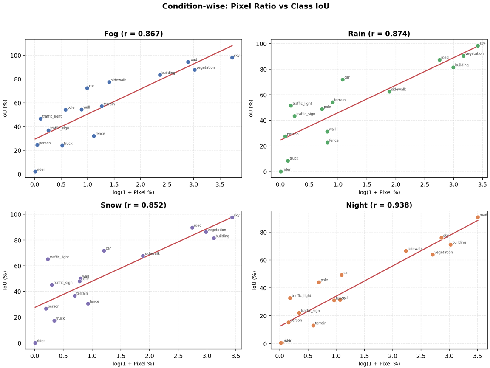
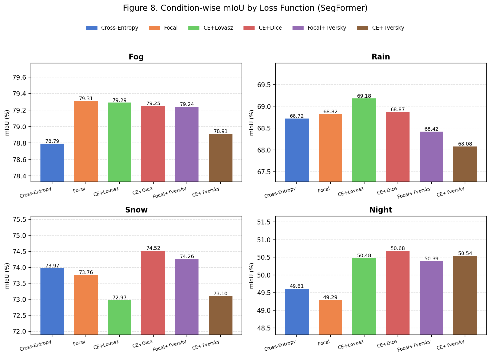
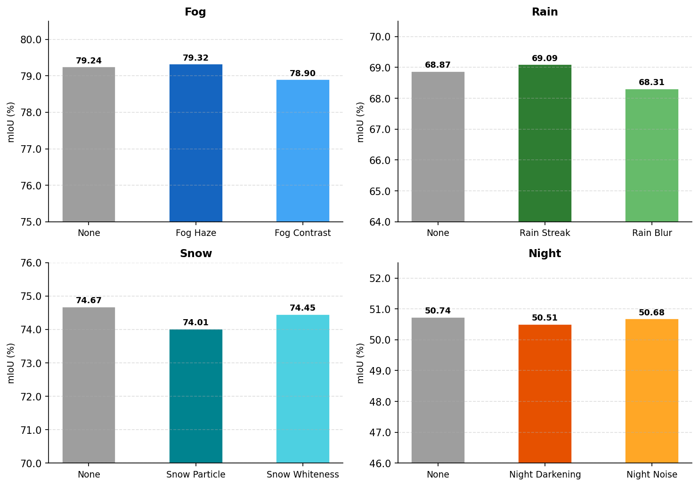
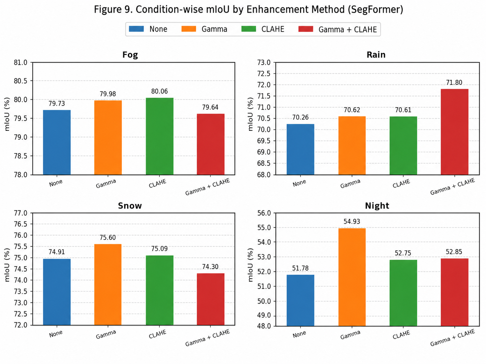
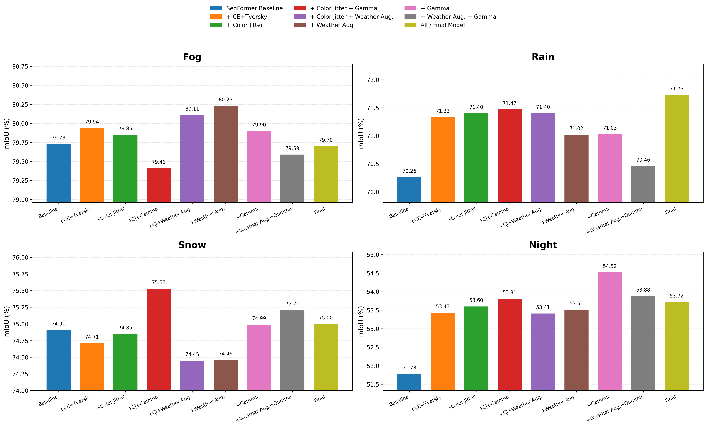

# 악천후 주행 환경에서의 강건한 Semantic Segmentation

<p align="center">
  <b>Adverse-Weather-Segmentation</b><br>
  ACDC 기반 악천후 주행 장면에서 semantic segmentation 모델의 조건별 강건성을 분석하고 개선하는 프로젝트
</p>

<p align="center">
  <a href="https://github.com/sangchun1/Adverse-Weather-Segmentation">Repository</a>
  · <a href="#개요">Overview</a>
  · <a href="#실험-결과">Results</a>
  · <a href="#재현-파이프라인">Reproduction</a>
  · <a href="#citation">Citation</a>
</p>

---

## 개요

악천후 주행 환경에서는 비, 안개, 눈, 야간 조명 변화로 인해 영상의 밝기, 대비, 가시성, texture 정보가 크게 달라진다. 이러한 변화는 자율주행 perception 시스템의 핵심 task인 semantic segmentation 성능을 저하시킬 수 있다.

본 프로젝트는 ACDC 기반 악천후 주행 데이터를 사용하여 semantic segmentation 모델의 조건별 강건성을 분석한다. 먼저 CNN 기반 **U-Net**과 transformer 기반 **SegFormer**, **SegFormer-LoRA**를 비교하고, 가장 높은 baseline 성능을 보인 SegFormer를 중심으로 loss function, weather-specific augmentation, image enhancement가 overall mIoU와 condition-wise mIoU에 미치는 영향을 분석한다.

이 프로젝트는 다음 질문을 중심으로 진행된다.

- U-Net, SegFormer, SegFormer-LoRA는 fog, rain, snow, night 조건에서 어떤 성능 차이를 보이는가?
- Loss function 변경은 class imbalance와 hard pixel 문제를 완화할 수 있는가?
- Weather-specific augmentation과 image enhancement는 조건별 성능을 안정적으로 향상시키는가?
- 전체 mIoU 개선과 특정 weather condition 개선 사이에 trade-off가 존재하는가?

<p align="center">
  
</p>
<p align="center">
  <b>Figure 1.</b> 전체 연구 파이프라인
</p>

---

## 주요 결과 요약

- **Backbone 선택의 영향이 가장 큼**: U-Net의 overall mIoU는 **47.19%**, SegFormer는 **71.86%**로, SegFormer가 U-Net 대비 **+24.67%p** 높은 성능을 보였다.
- **SegFormer가 모든 악천후 조건에서 가장 우수한 baseline**: fog, rain, snow, night 모두에서 U-Net 및 SegFormer-LoRA보다 높은 mIoU를 기록했다.
- **Loss function**: overall mIoU 기준 **CE+Lovasz**가 가장 높았고, **CE+Tversky**가 근소하게 뒤를 이었다. 소수 class IoU 합계에서는 CE+Tversky가 가장 높았다.
- **Weather-specific augmentation**: fog의 haze augmentation과 rain의 rain streak augmentation은 각각 소폭 개선을 보였지만, snow와 night에서는 제한적이었다.
- **Image enhancement**: **Gamma Correction**이 overall mIoU와 night condition에서 가장 큰 개선을 보였으며, night mIoU를 **51.78% → 54.93%**로 향상시켰다.
- **Final model**: SegFormer baseline 대비 overall mIoU를 **71.86% → 72.80%**로 **+0.94%p** 향상시켰고, 특히 rain과 night에서 각각 **+1.47%p**, **+1.94%p** 개선을 보였다.

---

## 주요 방법

본 프로젝트는 U-Net baseline에서 시작해 SegFormer 기반 실험으로 확장한다. 현재 main branch의 최종 설정은 `configs/final.yaml`에 정리되어 있으며, **SegFormer-B2 + CE+Tversky loss + color jitter + fog/rain weather-specific augmentation + night gamma enhancement**를 조합한다.

### 1. Baseline Models

| Model | 역할 | 설정 파일 |
|---|---|---|
| U-Net | CNN 기반 초기 baseline | `configs/unet_baseline.yaml` |
| SegFormer | Transformer 기반 주요 baseline | `configs/segformer_baseline.yaml` |
| SegFormer-LoRA | Parameter-efficient fine-tuning 비교 모델 | 별도 실험 결과 |
| Final SegFormer | 최종 조합 모델 | `configs/final.yaml` |

### 2. Loss Function

Class imbalance와 hard pixel 문제를 완화하기 위해 SegFormer baseline에 다양한 loss function을 적용하였다.

| Loss | 목적 | 결과 해석 |
|---|---|---|
| Cross-Entropy | 기본 픽셀 단위 분류 손실 | SegFormer baseline |
| Focal Loss | easy pixel의 기여도를 낮추고 hard pixel에 집중 | fog에서는 좋았지만 overall은 baseline보다 낮음 |
| CE + Lovasz | IoU surrogate를 함께 최적화 | overall mIoU 최고 |
| CE + Dice | region overlap 직접 최적화 | 모든 condition에서 baseline 상회 |
| Focal + Tversky | hard pixel 집중 + FN/FP 균형 조절 | CE보다 높지만 CE+Lovasz/CE+Tversky보다는 낮음 |
| CE + Tversky | class imbalance와 recall/precision trade-off 조절 | 소수 class IoU 합계 최고, final model에 사용 |

### 3. Weather-specific Augmentation

일반적인 color jitter와 함께 fog, rain, snow, night 조건별 degradation을 반영한 augmentation을 비교하였다.

| Condition | Augmentation | 적용 목적 |
|---|---|---|
| Fog | Haze | 안개로 인한 시정 저하와 대비 감소 반영 |
| Fog | Contrast Reduction | 저대비 환경에 대한 robustness 향상 |
| Rain | Rain Streak | 빗줄기가 객체 인식을 방해하는 상황 재현 |
| Rain | Motion Blur | 빗속 렌즈 흐림 및 움직임에 따른 경계 손상 재현 |
| Snow | Snow Particle | snow particle이 객체를 가리는 상황 재현 |
| Snow | Whiteness | 적설로 인해 전체 이미지가 밝고 하얗게 변하는 효과 반영 |
| Night | Darkening | 야간 저조도 특성 반영 |
| Night | Sensor Noise | 야간 촬영 시 발생하는 Gaussian noise 반영 |

<p align="center">
  
</p>
<p align="center">
  <b>Figure 2.</b> Augmentation 적용 예시
</p>

### 4. Image Enhancement

입력 영상의 밝기와 대비를 보정하여 low-visibility condition에서 segmentation 성능이 개선되는지 분석하였다.

| Enhancement | 설명 | 주요 결과 |
|---|---|---|
| Gamma Correction | 전체 밝기 분포를 비선형적으로 보정 | overall 및 night condition에서 가장 효과적 |
| CLAHE | 지역 대비 향상 | fog condition에서 가장 높은 mIoU 기록 |
| Gamma + CLAHE | 밝기 보정과 지역 대비 향상 결합 | rain condition에서 가장 높은 mIoU 기록 |

<p align="center">
  
</p>
<p align="center">
  <b>Figure 3.</b> Image enhancement 적용 예시
</p>

---

## 데이터셋

### ACDC 기반 악천후 주행 데이터

본 프로젝트는 **ACDC(Adverse Conditions Dataset with Correspondences)** 데이터셋을 사용한다. ACDC는 fog, rain, snow, night 네 가지 악천후 조건에서 수집된 주행 장면으로 구성되며, 각 이미지에는 픽셀 단위 semantic segmentation label이 제공된다.

- **Task**: 19-class semantic segmentation
- **Conditions**: fog, rain, snow, night
- **Reference condition**: normal reference image는 `normal.csv`로 별도 생성 가능
- **Input**: RGB driving scene image
- **Label**: Cityscapes-style `labelTrainIds`
- **Ignore index**: 255
- **Input size**: 1024 × 512
- **Main metrics**: overall mIoU, condition-wise mIoU, class-wise IoU

### 데이터 수

| Split | Fog | Rain | Snow | Night | Total |
|---|---:|---:|---:|---:|---:|
| Train | 400 | 400 | 400 | 400 | 1,600 |
| Validation | 100 | 100 | 100 | 106 | 406 |

> ACDC test set은 ground-truth label이 공개되어 있지 않으므로, 본 프로젝트의 정량 평가는 validation set 기준으로 수행하였다.

### Class 목록

```text
road, sidewalk, building, wall, fence, pole, traffic light, traffic sign,
vegetation, terrain, sky, person, rider, car, truck, bus, train,
motorcycle, bicycle
```

### Class imbalance

ACDC 데이터셋은 class별 픽셀 수가 매우 불균형하다. 예를 들어 sky는 **29.24%**, road는 **19.57%**를 차지하는 반면 rider는 **0.02%**, person은 **0.13%**에 불과하다. U-Net baseline 기준 픽셀 비율 1% 미만 소수 class의 평균 IoU는 **25.4%**로, 다수 class 평균 **64.4%**보다 크게 낮았다.

<p align="center">
  
</p>
<p align="center">
  <b>Figure 4.</b> Class imbalance와 class-wise IoU의 관계
</p>

### 데이터 구조

아래 구조로 `data/raw/`에 직접 배치한 뒤 split CSV를 생성한다.

```text
data/
├── raw/
│   ├── rgb_anon/
│   │   ├── fog/
│   │   ├── night/
│   │   ├── rain/
│   │   └── snow/
│   └── gt/
│       ├── fog/
│       ├── night/
│       ├── rain/
│       └── snow/
└── splits/
    ├── train.csv
    ├── val.csv
    ├── test.csv
    └── normal.csv      # optional
```

`prepare_dataset.py`는 기본적으로 `data/splits/train.csv`, `data/splits/val.csv`, `data/splits/test.csv`를 생성한다. `--skip-normal`을 사용하지 않으면 normal reference image를 모아 `data/splits/normal.csv`도 함께 생성한다.

---

## 평가 지표

모델 성능은 전체 성능과 조건별 성능을 함께 평가한다.

- **Overall mIoU**: 전체 validation set 기준 평균 IoU
- **Condition-wise mIoU**: fog, rain, snow, night 조건별 mIoU
- **Class-wise IoU**: 19개 semantic class별 IoU
- **Qualitative result**: RGB image, ground truth, prediction 비교
- **Error map**: ground truth와 prediction이 일치하지 않는 픽셀을 표시한 오분류 지도

---

## 실험 결과

### 1. Baseline 모델 비교

| Model | Overall mIoU | Fog | Rain | Snow | Night |
|---|---:|---:|---:|---:|---:|
| U-Net | 47.19 | 51.43 | 47.36 | 49.38 | 36.28 |
| SegFormer | **71.86** | **79.73** | **70.26** | **74.91** | **51.78** |
| SegFormer-LoRA | 69.97 | 79.18 | 68.55 | 73.34 | 49.76 |

<p align="center">
  
</p>
<p align="center">
  <b>Figure 5.</b> U-Net, SegFormer, SegFormer-LoRA의 condition-wise mIoU 비교
</p>

SegFormer는 U-Net 대비 overall mIoU를 **+24.67%p** 향상시켰고, 모든 악천후 조건에서 가장 높은 성능을 보였다. 이후 실험은 SegFormer를 주요 backbone으로 사용하였다.

### 2. Loss Function 비교

| Loss | Overall mIoU | Fog | Rain | Snow | Night |
|---|---:|---:|---:|---:|---:|
| Cross-Entropy | 71.18 | 78.79 | 68.72 | 73.97 | 49.61 |
| CE + Lovasz | **71.99** | 79.29 | **69.18** | 72.97 | 50.48 |
| CE + Tversky | 71.92 | 78.91 | 68.08 | 73.10 | 50.54 |
| CE + Dice | 71.90 | 79.25 | 68.87 | **74.52** | **50.68** |
| Focal + Tversky | 71.72 | 79.24 | 68.42 | 74.26 | 50.39 |
| Focal | 71.07 | **79.31** | 68.82 | 73.76 | 49.29 |

<p align="center">
  
</p>
<p align="center">
  <b>Figure 6.</b> Loss function별 condition-wise mIoU

Overall mIoU에서는 CE+Lovasz가 가장 높았고, CE+Tversky가 근소하게 뒤를 이었다. 소수 class IoU 합계에서는 CE+Tversky가 가장 높아 final model의 loss로 사용하였다.

### 3. Weather-specific Augmentation 비교

| Condition | Augmentation | mIoU | Change |
|---|---|---:|---:|
| Fog | None | 79.24 | - |
| Fog | Haze | **79.32** | **+0.08** |
| Fog | Contrast Reduction | 78.90 | -0.34 |
| Rain | None | 68.87 | - |
| Rain | Rain Streak | **69.09** | **+0.22** |
| Rain | Motion Blur | 68.31 | -0.56 |
| Snow | None | **74.67** | - |
| Snow | Snow Particle | 74.01 | -0.66 |
| Snow | Whiteness | 74.45 | -0.22 |
| Night | None | **50.74** | - |
| Night | Darkening | 50.51 | -0.23 |
| Night | Sensor Noise | 50.68 | -0.06 |

<p align="center">
  
</p>
<p align="center">
  <b>Figure 7.</b> Weather-specific augmentation별 condition-wise mIoU
</p>

Weather-specific augmentation은 fog와 rain처럼 degradation 형태가 비교적 명확한 조건에서는 소폭 개선을 보였지만, snow와 night에서는 실제 데이터 분포와 augmentation 강도가 충분히 일치하지 않아 성능 향상으로 이어지지 않았다.

### 4. Image Enhancement 비교

| Enhancement | Overall mIoU | Fog | Rain | Snow | Night |
|---|---:|---:|---:|---:|---:|
| None | 71.86 | 79.73 | 70.26 | 74.91 | 51.78 |
| Gamma | **73.13** | 79.98 | 70.62 | **75.60** | **54.93** |
| CLAHE | 72.32 | **80.06** | 70.61 | 75.09 | 52.75 |
| Gamma + CLAHE | 72.36 | 79.64 | **71.80** | 74.30 | 52.85 |

<p align="center">
  
</p>
<p align="center">
  <b>Figure 8.</b> Image enhancement별 condition-wise mIoU
</p>

Gamma Correction은 overall mIoU와 night condition에서 가장 큰 개선을 보였다. CLAHE는 fog에서 가장 좋았고, Gamma+CLAHE는 rain에서 가장 높았다.

### 5. Final Model Ablation Study

| Experiment | Loss | Augmentation | Enhancement | Overall mIoU | Fog | Rain | Snow | Night |
|---|---|---|---|---:|---:|---:|---:|---:|
| SegFormer Baseline | CE | None | None | 71.86 | 79.73 | 70.26 | 74.91 | 51.78 |
| + CE+Tversky | CE+Tversky | None | None | 72.60 | 79.94 | 71.33 | 74.71 | 53.43 |
| + Color Jitter | CE+Tversky | Color Jitter | None | 72.68 | 79.85 | 71.40 | 74.85 | 53.60 |
| + Color Jitter + Gamma | CE+Tversky | Color Jitter | Gamma | 72.77 | 79.41 | 71.47 | 75.53 | 53.81 |
| + Color Jitter + Weather Aug. | CE+Tversky | Color Jitter + Weather Aug. | None | 72.49 | 80.11 | 71.40 | 74.45 | 53.41 |
| + Weather Aug. | CE+Tversky | Weather Aug. | None | 72.53 | **80.23** | 71.02 | 74.46 | 53.51 |
| + Gamma | CE+Tversky | None | Gamma | **72.80** | 79.90 | 71.03 | 74.99 | **54.52** |
| + Weather Aug. + Gamma | CE+Tversky | Weather Aug. | Gamma | 72.61 | 79.59 | 70.46 | **75.21** | 53.88 |
| All / Final Model | CE+Tversky | Color Jitter + Weather Aug. | Gamma | **72.80** | 79.70 | **71.73** | 75.00 | 53.72 |

<p align="center">
  
</p>
<p align="center">
  <b>Figure 9.</b> Final model ablation study. <i>TODO: figures/final_ablation.png 추가</i>
</p>

### 6. Final Model과 SegFormer Baseline 비교

| Model | Overall mIoU | Fog | Rain | Snow | Night |
|---|---:|---:|---:|---:|---:|
| SegFormer Baseline | 71.86 | 79.73 | 70.26 | 74.91 | 51.78 |
| Final Model | **72.80** | 79.70 | **71.73** | **75.00** | **53.72** |
| Change | **+0.94** | -0.03 | **+1.47** | +0.09 | **+1.94** |

<p align="center">
  
</p>
<p align="center">
  <b>Figure 10.</b> SegFormer baseline과 final model 성능 비교. <i>TODO: figures/final_comparison.png 추가</i>
</p>

Final model은 모든 condition에서 최고 성능을 달성한 조합은 아니지만, overall 성능을 향상시키면서 주요 취약 조건인 rain과 night에서 의미 있는 개선을 제공하였다.

### 7. Qualitative Result 및 Error Map

<p align="center">
  
</p>
<p align="center">
  <b>Figure 11.</b> RGB image, ground truth, SegFormer baseline prediction, final model prediction 비교
</p>

---

## 구현 세부사항

| 항목 | 설정 |
|---|---|
| Framework | Python, PyTorch |
| Model implementation | Hugging Face Transformers, custom PyTorch modules |
| Configuration | YAML config files |
| Dataset | ACDC train/validation split |
| Input size | 1024 × 512 |
| Number of classes | 19 |
| Ignore index | 255 |
| Random seed | 42 |
| GPU | NVIDIA A100, NVIDIA GeForce RTX 5090 |
| Optimizer | AdamW |
| Scheduler for U-Net | Cosine annealing scheduler |
| Scheduler for SegFormer | Poly scheduler with warmup |
| Checkpoint selection | Best validation mIoU |
| Evaluation split | Validation set |
| Evaluation metrics | Overall mIoU, condition-wise mIoU, class-wise IoU |

---

## 설치

### 1. Repository clone

```bash
git clone https://github.com/sangchun1/Adverse-Weather-Segmentation.git
cd Adverse-Weather-Segmentation
```

### 2. Conda 환경 생성

```bash
conda create -n awseg python=3.10 -y
conda activate awseg
```

### 3. PyTorch 설치

사용 중인 CUDA 버전에 맞는 PyTorch를 먼저 설치한다.

예시: CUDA 12.8

```bash
pip install torch==2.7.1 torchvision==0.22.1 torchaudio==2.7.1 --index-url https://download.pytorch.org/whl/cu128
```

CUDA 버전이 다르면 PyTorch 공식 설치 가이드에 맞게 명령어를 수정한다.

### 4. Package 설치

```bash
pip install -U pip
pip install -e .
```

개발용 dependency까지 설치하려면 다음을 사용한다.

```bash
pip install -e ".[dev]"
```

모든 optional dependency를 함께 설치하려면 다음을 사용한다.

```bash
pip install -e ".[all]"
```

---

## 재현 파이프라인

현재 main branch의 실행 스크립트는 크게 두 개이다.

- `scripts/run.sh`: 단일 config 기준 final pipeline 실행
- `scripts/run_ablations.sh`: `configs/ablations/*.yaml`을 순차 실행

두 스크립트 모두 `nohup`으로 백그라운드 실행되며, 학습 이후 evaluation, visualization, error analysis, plot 생성까지 이어서 수행한다.

### 0. 데이터 split 생성

원본 데이터가 repository root의 `data/raw/`에 있는 경우:

```bash
python scripts/prepare_dataset.py
```

원본 데이터의 parent 경로가 다른 경우:

```bash
python scripts/prepare_dataset.py \
  --raw-data-parent /path/to/dataset-parent \
  --output-dir data/splits
```

normal reference split을 만들지 않으려면 다음을 사용한다.

```bash
python scripts/prepare_dataset.py --skip-normal
```

생성되는 CSV column은 다음과 같다.

```text
image_path,label_path,condition,split
```

### 1. Final pipeline 전체 실행

기본값은 `configs/final.yaml`, 전체 adverse-weather 조건, `cuda:0`이다.

```bash
bash scripts/run.sh
```

명시적으로 config, condition, device를 지정하려면 다음처럼 실행한다.

```bash
bash scripts/run.sh configs/final.yaml "" cuda:0
```

특정 condition만 사용하려면 두 번째 인자에 `fog`, `rain`, `snow`, `night` 중 하나를 넣는다.

```bash
bash scripts/run.sh configs/final.yaml night cuda:0
```

환경변수로도 지정할 수 있다.

```bash
CONDITION=night DEVICE=cuda:1 bash scripts/run.sh
```

실행 결과는 condition 지정 여부에 따라 다음 위치에 저장된다.

```text
# 전체 조건 실행
outputs/results/final/
outputs/visualizations/final/
outputs/analysis/final/
outputs/logs/final_YYYYMMDD_HHMMSS.log

# 특정 조건 실행 예: night
outputs/results/final_night/
outputs/visualizations/final_night/
outputs/analysis/final_night/
outputs/logs/final_night_YYYYMMDD_HHMMSS.log
```

로그 확인:

```bash
tail -f outputs/logs/final_YYYYMMDD_HHMMSS.log
```

### 2. Ablation study 실행

`configs/ablations/` 아래의 YAML을 순서대로 실행한다.

```bash
bash scripts/run_ablations.sh cuda:0
```

특정 ablation만 실행하려면 `EXPERIMENTS`에 파일명 또는 확장자를 제외한 이름을 지정한다.

```bash
EXPERIMENTS="01_baseline_segformer 02_ce_tversky" bash scripts/run_ablations.sh cuda:0
```

다른 GPU를 사용할 경우:

```bash
DEVICE=cuda:1 bash scripts/run_ablations.sh
```

실행 결과는 다음 구조로 저장된다.

```text
outputs/results/ablations/<experiment>/
outputs/visualizations/ablations/<experiment>/
outputs/analysis/ablations/<experiment>/
outputs/checkpoints/ablations/<experiment>/
outputs/tmp_configs/ablations/<experiment>.yaml
outputs/logs/ablations_YYYYMMDD_HHMMSS.log
```

### 3. 수동 학습 / 평가 / 시각화

자동 스크립트를 사용하지 않고 단계별로 실행할 수도 있다.

#### 학습

```bash
python -m awseg.train \
  --config configs/final.yaml \
  --result-dir outputs/results/final \
  --device cuda:0
```

특정 condition만 학습하려면:

```bash
python -m awseg.train \
  --config configs/final.yaml \
  --result-dir outputs/results/final_night \
  --condition night \
  --device cuda:0
```

#### 평가

```bash
python -m awseg.evaluate \
  --config configs/final.yaml \
  --checkpoint outputs/checkpoints/final/best_miou.pth \
  --split val \
  --result-dir outputs/results/final \
  --device cuda:0
```

특정 condition만 평가:

```bash
python -m awseg.evaluate \
  --config configs/final.yaml \
  --checkpoint outputs/checkpoints/final/best_miou.pth \
  --split val \
  --condition night \
  --result-dir outputs/results/final_night \
  --device cuda:0
```

#### 시각화

```bash
python -m awseg.visualize \
  --config configs/final.yaml \
  --checkpoint outputs/checkpoints/final/best_miou.pth \
  --split val \
  --output-dir outputs/visualizations/final \
  --samples-per-condition 5 \
  --shuffle \
  --seed 42 \
  --device cuda:0
```

특정 condition만 시각화:

```bash
python -m awseg.visualize \
  --config configs/final.yaml \
  --checkpoint outputs/checkpoints/final/best_miou.pth \
  --split val \
  --condition night \
  --output-dir outputs/visualizations/final_night \
  --num-samples 20 \
  --device cuda:0
```

#### Error analysis

전체 validation set 기준:

```bash
python scripts/analyze_errors.py \
  --config configs/final.yaml \
  --checkpoint outputs/checkpoints/final/best_miou.pth \
  --split val \
  --condition none \
  --device cuda:0 \
  --output-dir outputs/analysis/final
```

특정 condition 기준:

```bash
python scripts/analyze_errors.py \
  --config configs/final.yaml \
  --checkpoint outputs/checkpoints/final/best_miou.pth \
  --split val \
  --condition night \
  --device cuda:0 \
  --output-dir outputs/analysis/final_night
```

#### 결과 plot 생성

```bash
python scripts/plot_results.py \
  --result-dir outputs/results/final \
  --output-dir outputs/results/final/plots
```

---


## 결론

본 프로젝트에서는 악천후 주행 장면에서 semantic segmentation 모델의 조건별 강건성을 분석하였다. Cityscapes 기반 pretrained SegFormer는 U-Net보다 모든 조건에서 높은 성능을 보였으며, 이후 실험의 주요 backbone으로 적합함을 확인하였다. Loss function 실험에서는 region overlap 기반 loss가 class imbalance와 소수 class 성능 개선에 효과적이었고, image enhancement 실험에서는 Gamma Correction과 CLAHE가 각각 night와 fog처럼 특정 degradation이 뚜렷한 조건에서 성능 개선을 보였다.

최종 모델은 SegFormer baseline 대비 overall mIoU를 향상시켰으며, 특히 rain과 night 조건에서 의미 있는 개선을 보였다. 다만 모든 기법이 모든 조건에서 일관된 향상을 보인 것은 아니므로, 향후에는 condition별 degradation 특성에 따라 loss, augmentation, enhancement를 선택적으로 조합하는 전략이 필요하다.

---

## Citation

이 repository를 사용하거나 참고하는 경우 아래 형식으로 인용할 수 있다.

```bibtex
@misc{adverseweathersegmentation2026,
  title  = {Condition-wise Robustness Analysis of Semantic Segmentation for Adverse Weather Driving Scenes},
  author = {Park, Sangchun and Baek, Gyeongmin and Son, Gyuyeong and Song, Hyunmin and Lim, Changwon},
  year   = {2026},
  url    = {https://github.com/sangchun1/Adverse-Weather-Segmentation}
}
```

---

## Acknowledgements

본 프로젝트는 중앙대학교 이미지 데이터 분석을 위한 딥러닝 강의의 팀 프로젝트로 수행되었다. 악천후 주행 장면에서 semantic segmentation 모델의 강건성을 분석하고, 조건별 성능 개선 방법을 비교하는 것을 목표로 한다.
