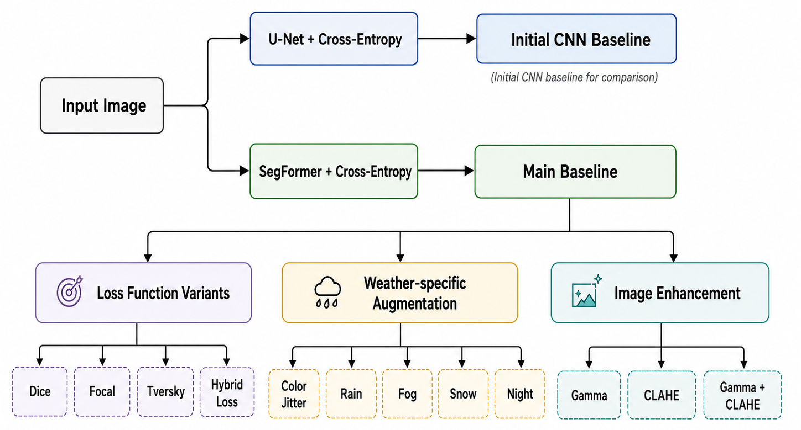
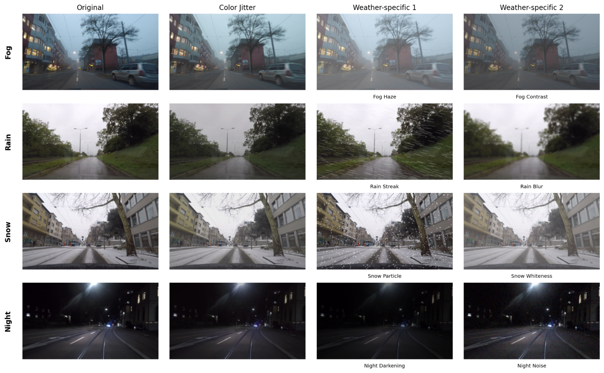
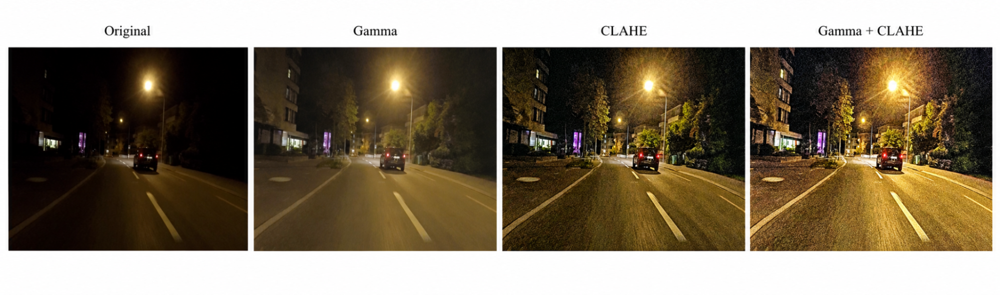
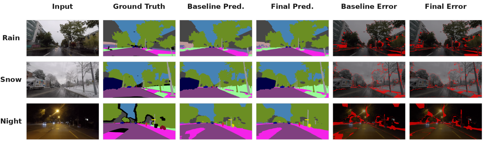
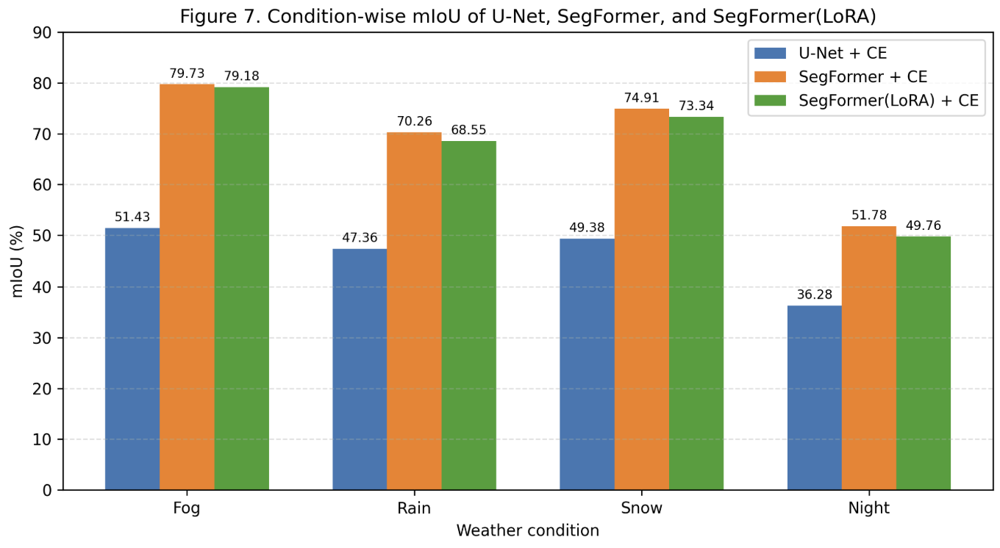
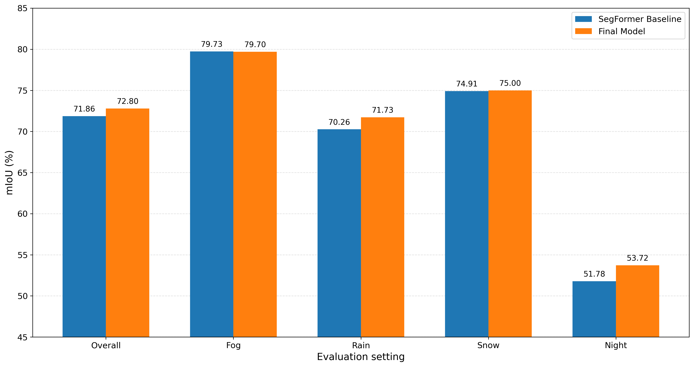

# 악천후 주행 환경에서의 강건한 Semantic Segmentation

<p align="center">
  <b>Adverse-Weather-Segmentation</b><br>
  ACDC 기반 악천후 주행 장면에서 semantic segmentation 모델의 강건성을 분석하고 개선하는 프로젝트
</p>

<p align="center">
  <a href="https://github.com/sangchun1/Adverse-Weather-Segmentation">Repository</a>
  · <a href="#개요">Overview</a>
  · <a href="#프로젝트-구조">Structure</a>
  · <a href="#재현-파이프라인">Reproduction</a>
  · <a href="#실험-결과">Results</a>
  · <a href="#citation">Citation</a>
</p>

---

## 개요

악천후 주행 환경에서는 비, 안개, 눈, 야간 조명 변화로 인해 영상의 밝기, 대비, 가시성, texture 정보가 크게 달라진다. 이러한 변화는 자율주행 perception 시스템의 핵심 task인 semantic segmentation 성능을 저하시킬 수 있다.

본 프로젝트는 ACDC 기반 악천후 주행 데이터를 사용하여 semantic segmentation 모델의 조건별 강건성을 분석한다. 초기 baseline으로는 U-Net을 사용하고, 주요 backbone으로는 SegFormer를 사용한다. 이후 loss function, weather-specific augmentation, image enhancement를 결합하여 rain, fog, snow, night 조건에서의 성능 변화를 비교한다.

이 프로젝트는 다음 질문을 중심으로 진행된다.

- 악천후 조건에서는 segmentation 성능이 어떻게 달라지는가?
- U-Net과 SegFormer는 rain, fog, snow, night 조건에서 어떤 차이를 보이는가?
- Loss function, augmentation, enhancement 중 어떤 접근이 조건별 강건성 개선에 효과적인가?
- 전체 mIoU 개선과 특정 weather condition 개선 사이에 trade-off가 존재하는가?

<p align="center">
  
</p>
<p align="center">
  <b>Figure 1.</b> 전체 연구 파이프라인. <i>TODO: figures/overview_pipeline.png 추가</i>
</p>

---

## 주요 방법

본 프로젝트는 U-Net baseline에서 시작해 SegFormer 기반 실험으로 확장한다. 최종 설정은 `configs/final.yaml`에 정리되어 있으며, SegFormer backbone, CE+Tversky loss, color jitter, fog/rain weather augmentation, night gamma enhancement를 조합한다.

### 1. Baseline Models

| Model | 역할 | 설정 파일 |
|---|---|---|
| U-Net | CNN 기반 초기 baseline | `configs/unet_baseline.yaml` |
| SegFormer | Transformer 기반 주요 baseline | `configs/segformer_baseline.yaml` |
| Final SegFormer | 최종 조합 모델 | `configs/final.yaml` |

### 2. Loss Function

Class imbalance와 hard pixel 문제를 완화하기 위해 여러 segmentation loss를 비교한다.

| Loss | 목적 | 구현 위치 |
|---|---|---|
| Cross-Entropy | 기본 픽셀 단위 분류 손실 | `src/awseg/losses/cross_entropy.py` |
| Dice Loss | 작은 객체 및 class imbalance 완화 | `src/awseg/losses/dice.py` |
| Focal Loss | hard pixel에 더 큰 가중치 부여 | `src/awseg/losses/focal.py` |
| Tversky Loss | false positive / false negative 균형 조절 | `src/awseg/losses/tversky.py` |
| Lovasz / OHEM / Hybrid | IoU surrogate, hard example mining, 조합 손실 | `src/awseg/losses/` |

### 3. Weather-specific Augmentation

일반적인 color jitter뿐 아니라 악천후 조건의 시각적 degradation을 반영한 augmentation을 적용한다.

| Augmentation | 적용 목적 | 대상 조건 |
|---|---|---|
| Color Jitter | 밝기, 대비, 채도 변화에 대한 강건성 | All |
| Synthetic Rain | 빗줄기 및 contrast 변화 반영 | Rain |
| Synthetic Fog | haze 및 저가시성 반영 | Fog |
| Synthetic Snow | snow particle 및 밝기 변화 반영 | Snow |
| Synthetic Night | 저조도 및 조명 변화 반영 | Night |

<p align="center">
  
</p>
<p align="center">
  <b>Figure 2.</b> Augmentation 적용 예시. <i>TODO: figures/augmentation_examples.png 추가</i>
</p>

### 4. Image Enhancement

입력 영상의 밝기와 대비를 보정하여 low-visibility condition에서 segmentation 성능이 개선되는지 분석한다.

| Enhancement | 설명 | 기대 효과 |
|---|---|---|
| Gamma Correction | 전체 밝기 분포 보정 | Night 조건의 저조도 영역 개선 |
| CLAHE | 지역 대비 향상 | Fog / Night 조건의 객체 경계 강조 |
| Gamma + CLAHE | 밝기 보정과 지역 대비 향상 결합 | 단일 enhancement 대비 보완 효과 분석 |

<p align="center">
  
</p>
<p align="center">
  <b>Figure 3.</b> Image enhancement 적용 예시. <i>TODO: figures/enhancement_examples.png 추가</i>
</p>

---

## 데이터셋

### ACDC 기반 악천후 주행 데이터

본 프로젝트는 ACDC 기반의 악천후 주행 장면 데이터를 사용한다. Semantic segmentation label은 Cityscapes-style 19개 class를 기준으로 한다.

- **Task**: 19-class semantic segmentation
- **Conditions**: fog, night, rain, snow
- **Reference condition**: normal reference image는 `normal.csv`로 별도 생성 가능
- **Input**: RGB driving scene image
- **Label**: pixel-wise semantic mask
- **Main metric**: mIoU, condition-wise mIoU, class-wise IoU

### Class 목록

```text
road, sidewalk, building, wall, fence, pole, traffic light, traffic sign,
vegetation, terrain, sky, person, rider, car, truck, bus, train,
motorcycle, bicycle
```

### 데이터 구조

원본 ACDC 데이터는 repository에 포함하지 않는다. 아래 구조로 `data/raw/`에 직접 배치한 뒤 split CSV를 생성한다.

```text
data/
├── raw/
│   ├── rgb_anon/
│   │   ├── fog/
│   │   ├── night/
│   │   ├── rain/
│   │   └── snow/
│   └── gt/
│       ├── fog/
│       ├── night/
│       ├── rain/
│       └── snow/
└── splits/
    ├── train.csv
    ├── val.csv
    └── test.csv
```

`prepare_dataset.py`는 기본적으로 `data/splits/train.csv`, `data/splits/val.csv`, `data/splits/test.csv`를 생성한다. `--skip-normal`을 사용하지 않으면 normal reference image를 모아 `data/splits/normal.csv`도 함께 생성한다.

---

## 평가 지표

모델 성능은 전체 성능과 조건별 성능을 함께 평가한다.

- **Overall mIoU**: 전체 validation/test set 기준 평균 IoU
- **Condition-wise mIoU**: fog, night, rain, snow 조건별 mIoU
- **Class-wise IoU**: 19개 semantic class별 IoU
- **Qualitative result**: RGB image, ground truth, prediction 비교
- **Error map**: 오분류 픽셀 위치 시각화

<p align="center">
  
</p>
<p align="center">
  <b>Figure 4.</b> 정성적 결과 예시. <i>TODO: figures/qualitative_examples.png 추가</i>
</p>

---

## 실험 결과

아래 표의 값은 최종 실험 결과가 정리되는 대로 채운다.

### 1. U-Net vs SegFormer Baseline

| Model | Config | Overall mIoU | Fog | Night | Rain | Snow |
|---|---|---:|---:|---:|---:|---:|
| U-Net | `configs/unet_baseline.yaml` | TODO | TODO | TODO | TODO | TODO |
| SegFormer | `configs/segformer_baseline.yaml` | TODO | TODO | TODO | TODO | TODO |

<p align="center">
  
</p>
<p align="center">
  <b>Figure 5.</b> U-Net과 SegFormer의 condition-wise mIoU 비교. <i>TODO: figures/baseline_condition_miou.png 추가</i>
</p>

### 2. Ablation Study

| Experiment | Config | 핵심 변경 | Overall mIoU | Fog | Night | Rain | Snow |
|---|---|---|---:|---:|---:|---:|---:|
| Baseline SegFormer | `01_baseline_segformer.yaml` | SegFormer baseline | TODO | TODO | TODO | TODO | TODO |
| CE + Tversky | `02_ce_tversky.yaml` | Loss 변경 | TODO | TODO | TODO | TODO | TODO |
| Color Jitter | `03_color_jitter.yaml` | Basic augmentation | TODO | TODO | TODO | TODO | TODO |
| Color Jitter + Gamma | `04_color_jitter_gamma.yaml` | Augmentation + enhancement | TODO | TODO | TODO | TODO | TODO |
| Color Jitter + Weather Aug | `05_color_jitter_weather_aug.yaml` | Weather-specific augmentation | TODO | TODO | TODO | TODO | TODO |
| Final All | `06_final_all.yaml` | 최종 조합 | TODO | TODO | TODO | TODO | TODO |

### 3. Final Model

| Model | Config | Overall mIoU | Fog | Night | Rain | Snow |
|---|---|---:|---:|---:|---:|---:|
| SegFormer Final | `configs/final.yaml` | TODO | TODO | TODO | TODO | TODO |

<p align="center">
  
</p>
<p align="center">
  <b>Figure 6.</b> Final model 성능 비교. <i>TODO: figures/final_comparison.png 추가</i>
</p>

### 주요 분석 요약

- **TODO**: 전체 mIoU 기준 가장 좋은 방법 정리
- **TODO**: fog / night / rain / snow 조건별 가장 효과적인 방법 정리
- **TODO**: 특정 condition 개선이 전체 성능에 미친 trade-off 정리
- **TODO**: class-wise IoU에서 개선 또는 악화가 뚜렷한 class 정리

---

## 설치

### 1. Repository clone

```bash
git clone https://github.com/sangchun1/Adverse-Weather-Segmentation.git
cd Adverse-Weather-Segmentation
```

### 2. Conda 환경 생성

```bash
conda create -n awseg python=3.10 -y
conda activate awseg
```

### 3. PyTorch 설치

사용 중인 CUDA 버전에 맞는 PyTorch를 먼저 설치한다.

예시: CUDA 12.8

```bash
pip install torch==2.7.1 torchvision==0.22.1 torchaudio==2.7.1 --index-url https://download.pytorch.org/whl/cu128
```

CUDA 버전이 다르면 PyTorch 공식 설치 가이드에 맞게 명령어를 수정한다.

### 4. Package 설치

```bash
pip install -U pip
pip install -e .
```

개발용 dependency까지 설치하려면 다음을 사용한다.

```bash
pip install -e ".[dev]"
```

모든 optional dependency를 함께 설치하려면 다음을 사용한다.

```bash
pip install -e ".[all]"
```

---

## 재현 파이프라인

현재 main branch의 실행 스크립트는 크게 두 개이다.

- `scripts/run.sh`: 단일 config 기준 final pipeline 실행
- `scripts/run_ablations.sh`: `configs/ablations/*.yaml`을 순차 실행

두 스크립트 모두 `nohup`으로 백그라운드 실행되며, 학습 이후 evaluation, visualization, error analysis, plot 생성까지 이어서 수행한다.

### 0. 데이터 split 생성

원본 데이터가 repository root의 `data/raw/`에 있는 경우:

```bash
python scripts/prepare_dataset.py
```

원본 데이터의 parent 경로가 다른 경우:

```bash
python scripts/prepare_dataset.py \
  --raw-data-parent /path/to/dataset-parent \
  --output-dir data/splits
```

normal reference split을 만들지 않으려면 다음을 사용한다.

```bash
python scripts/prepare_dataset.py --skip-normal
```

생성되는 CSV column은 다음과 같다.

```text
image_path,label_path,condition,split
```

### 1. Final pipeline 전체 실행

기본값은 `configs/final.yaml`, 전체 adverse-weather 조건, `cuda:0`이다.

```bash
bash scripts/run.sh
```

명시적으로 config, condition, device를 지정하려면 다음처럼 실행한다.

```bash
bash scripts/run.sh configs/final.yaml "" cuda:0
```

특정 condition만 사용하려면 두 번째 인자에 `fog`, `night`, `rain`, `snow` 중 하나를 넣는다.

```bash
bash scripts/run.sh configs/final.yaml night cuda:0
```

환경변수로도 지정할 수 있다.

```bash
CONDITION=night DEVICE=cuda:1 bash scripts/run.sh
```

실행 결과는 condition 지정 여부에 따라 다음 위치에 저장된다.

```text
# 전체 조건 실행
outputs/results/final/
outputs/visualizations/final/
outputs/analysis/final/
outputs/logs/final_YYYYMMDD_HHMMSS.log

# 특정 조건 실행 예: night
outputs/results/final_night/
outputs/visualizations/final_night/
outputs/analysis/final_night/
outputs/logs/final_night_YYYYMMDD_HHMMSS.log
```

로그 확인:

```bash
tail -f outputs/logs/final_YYYYMMDD_HHMMSS.log
```

### 2. Ablation study 전체 실행

`configs/ablations/` 아래의 모든 YAML을 순서대로 실행한다.

```bash
bash scripts/run_ablations.sh cuda:0
```

특정 ablation만 실행하려면 `EXPERIMENTS`에 파일명 또는 확장자를 제외한 이름을 지정한다.

```bash
EXPERIMENTS="01_baseline_segformer 02_ce_tversky" bash scripts/run_ablations.sh cuda:0
```

다른 GPU를 사용할 경우:

```bash
DEVICE=cuda:1 bash scripts/run_ablations.sh
```

실행 결과는 다음 구조로 저장된다.

```text
outputs/results/ablations/<experiment>/
outputs/visualizations/ablations/<experiment>/
outputs/analysis/ablations/<experiment>/
outputs/checkpoints/ablations/<experiment>/
outputs/tmp_configs/ablations/<experiment>.yaml
outputs/logs/ablations_YYYYMMDD_HHMMSS.log
```

### 3. 수동 학습 / 평가 / 시각화

자동 스크립트를 사용하지 않고 단계별로 실행할 수도 있다.

#### 학습

```bash
python -m awseg.train \
  --config configs/final.yaml \
  --result-dir outputs/results/final \
  --device cuda:0
```

특정 condition만 학습하려면:

```bash
python -m awseg.train \
  --config configs/final.yaml \
  --result-dir outputs/results/final_night \
  --condition night \
  --device cuda:0
```

#### 평가

```bash
python -m awseg.evaluate \
  --config configs/final.yaml \
  --checkpoint outputs/checkpoints/final/best_miou.pth \
  --split val \
  --result-dir outputs/results/final \
  --device cuda:0
```

#### 시각화

```bash
python -m awseg.visualize \
  --config configs/final.yaml \
  --checkpoint outputs/checkpoints/final/best_miou.pth \
  --split val \
  --output-dir outputs/visualizations/final \
  --samples-per-condition 5 \
  --shuffle \
  --seed 42 \
  --device cuda:0
```

#### Error analysis

```bash
python scripts/analyze_errors.py \
  --group final \
  --condition none \
  --config configs/final.yaml \
  --checkpoint outputs/checkpoints/final/best_miou.pth \
  --output-dir outputs/analysis/final \
  --device cuda:0
```

특정 condition만 분석할 경우:

```bash
python scripts/analyze_errors.py \
  --group final \
  --condition night \
  --config configs/final.yaml \
  --checkpoint outputs/checkpoints/final/best_miou.pth \
  --output-dir outputs/analysis/final_night \
  --device cuda:0
```

#### Plot 생성

```bash
python scripts/plot_results.py \
  --group final \
  --output-dir outputs/visualizations/final/plots
```

특정 result directory를 직접 지정하려면:

```bash
python scripts/plot_results.py \
  --eval-file outputs/results/final/eval_val.json \
  --history-file outputs/results/final/train_history.json \
  --output-dir outputs/visualizations/final/plots
```

---

## Final Config 요약

`configs/final.yaml`의 핵심 설정은 다음과 같다.

| 항목 | 값 |
|---|---|
| Model | SegFormer-B2, `nvidia/segformer-b2-finetuned-cityscapes-1024-1024` |
| Loss | CE + Tversky |
| Optimizer | AdamW |
| Scheduler | Poly LR schedule |
| Epochs | 100 |
| Batch size | 8 |
| Input size | 1024 × 512 |
| Augmentation | Color Jitter + condition-specific fog/rain augmentation |
| Enhancement | Gamma correction, night condition 적용 |
| Checkpoint | `outputs/checkpoints/final/best_miou.pth` |

---

## 빠른 실행 예시

### 전체 final 실험

```bash
conda activate awseg
python scripts/prepare_dataset.py
bash scripts/run.sh configs/final.yaml "" cuda:0
```

### Night condition만 실험

```bash
conda activate awseg
bash scripts/run.sh configs/final.yaml night cuda:0
```

### Ablation 2개만 실험

```bash
conda activate awseg
EXPERIMENTS="01_baseline_segformer 02_ce_tversky" bash scripts/run_ablations.sh cuda:0
```

---


## Citation

이 repository를 사용하거나 참고하는 경우 아래 형식으로 인용할 수 있다.

```bibtex
@misc{adverseweathersegmentation2026,
  title  = {Robust Semantic Segmentation under Adverse Weather Conditions},
  author = {Adverse-Weather-Segmentation Team},
  year   = {2026},
  url    = {https://github.com/sangchun1/Adverse-Weather-Segmentation}
}
```

---

## Acknowledgements

본 프로젝트는 이미지 데이터 분석을 위한 딥러닝 강의의 팀 프로젝트로 수행되었다. 악천후 주행 장면에서 semantic segmentation 모델의 강건성을 분석하고, 조건별 성능 개선 방법을 비교하는 것을 목표로 한다.
